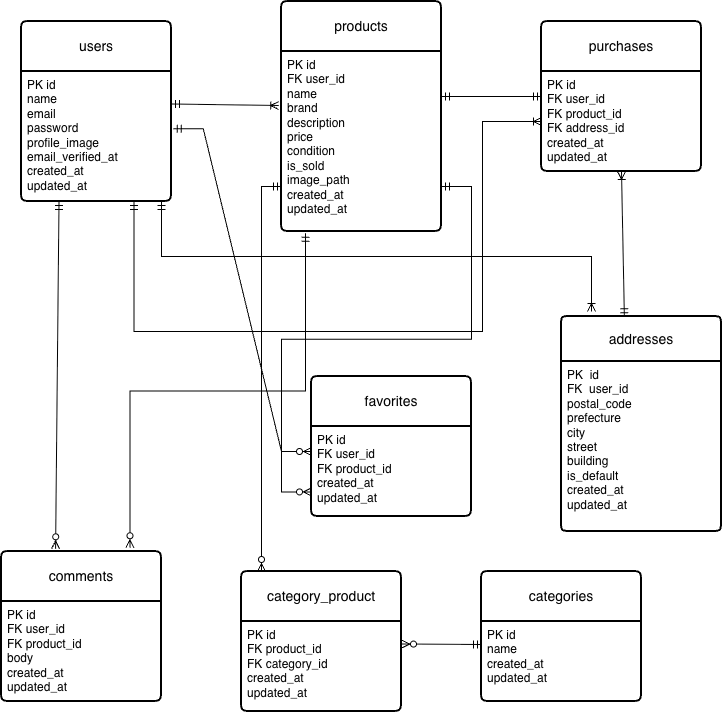

## フリマアプリ

## URL
- 開発環境：http://localhost/

※ブラウザで http://localhost/ にアクセスしてください

- phpMyAdmin：http://localhost:8080/

## 概要

本アプリはLaravelを用いて開発したフリマアプリです。
ユーザーは商品を出品・購入でき、いいねやコメント機能を通じて他ユーザーと交流できます。
※本アプリはDocker環境での動作を前提としています
※Docker Desktopがインストールされている必要があります

# 主な機能
## 商品関連

商品一覧表示

商品詳細表示

商品検索

商品出品

売り切れ表示

## ユーザーアクション

いいね機能

コメント機能

## 購入機能

商品購入

支払い方法選択（Stripe）

## ユーザー管理

会員登録 / ログイン（Laravel Fortify）

マイページ表示

プロフィール編集

## ER図

## 使用技術

PHP 8.x

Laravel 10.x

MySQL

Laravel Fortify（認証）

Stripe（決済）

Mailtrap：メール認証機能の動作確認に使用

FormRequest：バリデーション処理をコントローラから分離し、可読性と保守性を向上

## 環境構築

1.リポジトリをクローン

git clone https://github.com/rikutomashio/flea-market-app.git

cd flea-market-app

2.Docker起動

docker-compose up -d --build

3.PHPコンテナに入る

docker-compose exec php bash

4.Laravel初期設定

composer install

cp .env.example .env

php artisan key:generate

5.DB設定（.env）

※.envのDB設定を必ず上記の内容に変更してください

DB_CONNECTION=mysql

DB_HOST=mysql

DB_PORT=3306

DB_DATABASE=laravel_db

DB_USERNAME=laravel_user

DB_PASSWORD=laravel_pass

6.マイグレーション（シーディングも含めて）

php artisan migrate:fresh --seed 

※既存データを削除して初期状態から構築されます

7.ストレージリンク

php artisan storage:link

## 初期データ

シーディングにより以下のテストユーザーが作成されます。

メールアドレス: test1@example.com  
パスワード: password

メールアドレス: test2@example.com  
パスワード: password

## 動作確認手順

1. トップページにアクセス（http://localhost/）

2. 「ログイン」から以下のアカウントでログイン
   - test1@example.com / password

3. 商品一覧が表示されることを確認

4. 商品詳細ページを開く

5. いいねボタンが押せることを確認

6. コメントが投稿できることを確認

7. 商品を出品できることを確認

   ※出品した商品は別ユーザーでログインすると購入可能です

8. 商品を購入できることを確認（Stripeテスト）

【Stripeテストカード】
カード番号：4242 4242 4242 4242  
有効期限：未来日  
CVC：任意

9. マイページで購入履歴・出品商品が確認できること

## テスト
php artisan test

## テーブル構成

users

products

purchases

addresses

favorites

comments

categories

category_product（中間テーブル）

# 画面一覧

## 画面URL

商品一覧画面（トップ）	/
   
商品一覧（マイリスト）	/?tab=mylist

会員登録	/register

ログイン	/login

商品詳細	/item/{item_id}

商品購入	/purchase/{item_id}

送付先住所変更	/purchase/address/{item_id}

商品出品	/sell

マイページ	/mypage

プロフィール編集	/mypage/profile
  
購入商品一覧	/mypage?page=buy

出品商品一覧	/mypage?page=sell

## 工夫した点

売り切れ商品の表示制御

いいね・コメントの非同期的なユーザー体験

マイページで出品商品・購入商品を分離表示

中間テーブルを用いたカテゴリ管理

## 注意事項

Stripeはテストモードで動作します

※Stripeはテストモードのため実際の決済は行われません

画像アップロードはstorage配下に保存されます

## 作成者

名前 真尾陸人
